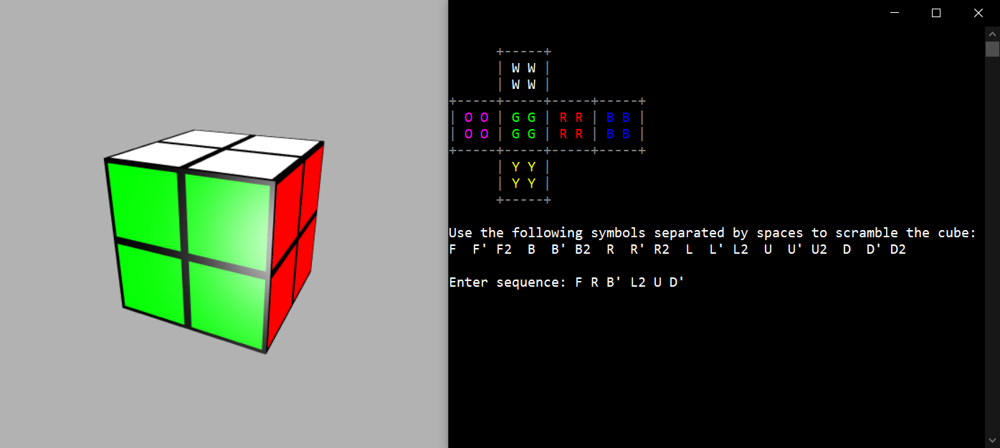
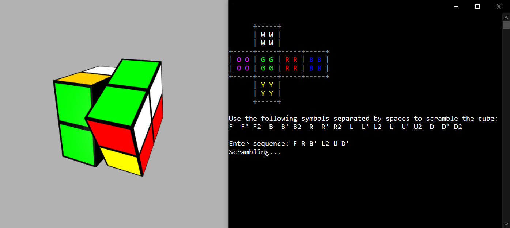
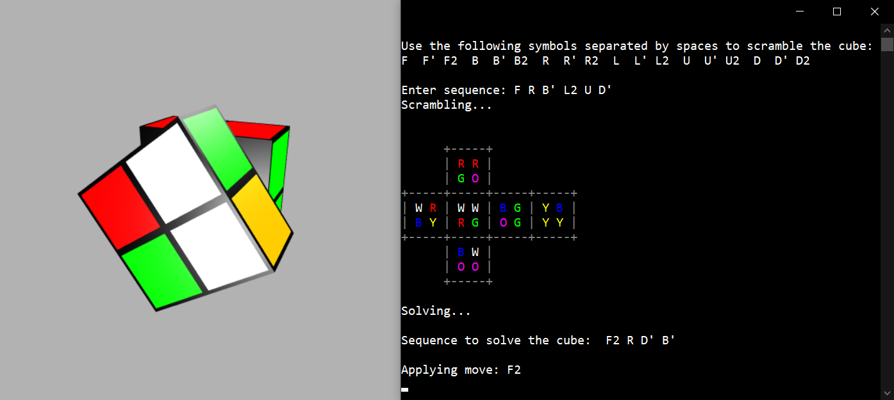
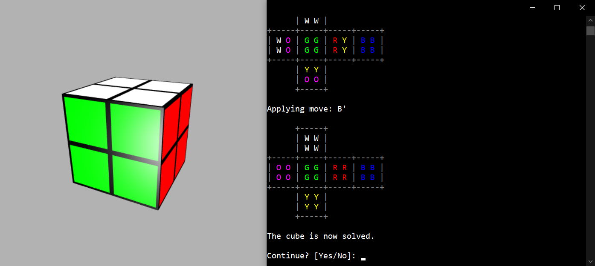

# Rubik's Cube 2x2x2 Solver

## *Abstract*
The 2x2x2 Rubik's Cube (also known as the Pocket Cube or Mini Cube) is composed of just 8 corner pieces. Even though it is a simplified version of the regular Rubik's Cube, the Pocket Cube has 3674160 possible configurations. Being the total number of states finite, any [search algorithm](https://en.wikipedia.org/wiki/Search_algorithm) that is both complete and optimal can give us the shortest sequence of moves to solve any scrambled cube (e.g. BFS, Dijkstra, A*). It has been proven that the maximum number of moves required to solve any Pocket Cube is 11, but currently there is no known procedure to know exactly what these 11 moves are without searching in the states space or listing every possible state in a table with their distance from the solve state in terms of moves.

## *Algorithms*
Two were the main approaches implemented in this project:
* The first one uses the tradtional [A*](https://en.wikipedia.org/wiki/A*_search_algorithm) algorithm which is an informed search strategy that utilizes prior information to compute an heuristic function able to estimate the number of moves to reach the goal state. This strategy is implemented in a graph-search fashion, meaning that reapeated states are eliminated.

* The second one exploits the precomputation of a table by means of  [BFS](https://en.wikipedia.org/wiki/Breadth-first_search) (Breadth First Search), that is stored in a database. This lookup table lists every single unique state with its distance (in moves) from the solved state, thus giving us a perfect heuristic value that allows to expand the least number of nodes in the search for a solution using for example A*.

## *Heuristics*

As previously mentioned, the heuristic value is the estimatation of the minimum number of steps required to get from the current state to the goal state, the closer to the real value the better the performace. But, in case of graph-search, two main properties has to be respected:
* **Admissability**: the estimation must never exceed the real value *h(n) <= h\*(n)*;
* **Consistency**: the estimation of a parent state must never exceed the estimation of a child state plus the cost of the arc between them *h(n) <= h(n') + c(n, n')* - (Note that consistency implies admissability);

How do we choose a consistent heuristic function? A choice could be *h(n) = 0* which is trivially consistent, but it wouldn't be of any help as the A* search would be reduced to the Dijkstra algorithm and no prior knowledge could be exploited to speed up the search. 

Three heuristics were taken into account:

* Sum of number of misplaced colors in all 6 faces divided by 4 to guarantee consistency (as a single move can only move 4 pieces);
* 3D [Manhattan distance](https://en.wikipedia.org/wiki/Taxicab_geometry), also known as taxicab matrix, is the sum of moves to correctly position all 8 pieces indipendently, and then divided by 4 (for the same reason as above);
* [Pattern database](https://algorithmsinsight.wordpress.com/graph-theory-2/implementing-bfs-for-pattern-database/), which is a lookup table that stores every cube state with the real distance from solved state (precomputed using BFS);

## *Moves pruning*
In order to speed up the computation, some properties of the cube have been exploited in order to prune redundant moves:
* The same face cannot be moved twice in a row (prunes 3 moves):
    - Opposite moves cancel each other out (e.g. F and F');
    - Two half turn rotations bring us back to original state (e.g. F2 and F2);
    - Two quarter turn rotations are redundant as a trivial shortest path would be to use an half turn rotation (e.g. F and F);
* Given the simmetry of the 2x2x2 cube, one corner piece is always positioned and oriented (prunes 9 moves):
    - Arbitrarily, the BLD (back, left, down) corner piece has been fixed, after performing moves on B, L or D faces, no moves regarding opposite faces, respectevly, F, R or U can be performed;

## *Pattern Database*
In this implementation, the pattern database stores the cube state as a string composed of permutations of characters which are arbitrarily coded to represent 6 different colors. For each new state the depth in which the state has been found, by using BFS starting by the solved cube, is saved in the pattern database.

## *Visualization*
Two modalities have been implemented to better represent and visualize the cube state:
* **2D** flattened cube on the terminal print out using ASCII characters (for portability purposes magenta was used instead of orange);
* **3D** interactive visualization implemented by means of the module VPython (that renders the cube and the animations in the browser with WebGL);

## *Results*
As stated in literature, Manhattan distance was the worst heuristic function out of all 3 considered in this work. The number of misplaced block while it was efficient enough to be used to solve most scrambled cubes, it was computationally demanding for longer sequences of scrambling as time complexity increases exponentially with the depth of the solution. Pattern database was the best heuristic as, of course, it gives the true estimate value, but for this python implementation required several hours for the completion of the all the database's entries.

## *Usage information*
- Install all the requirements in requirements.txt
    ```
    $ pip3 install -r requirements.txt
    ```
- Run rubik_solver.py and enter the desired sequence of moves to scramble the cube in the console, e.g:
    ```
    Enter sequence: F L R' U2 D' B
    ``` 
    After computing the solution, a 3D animation of cube solving will start shortly after. 
    
## *Screenshots*




